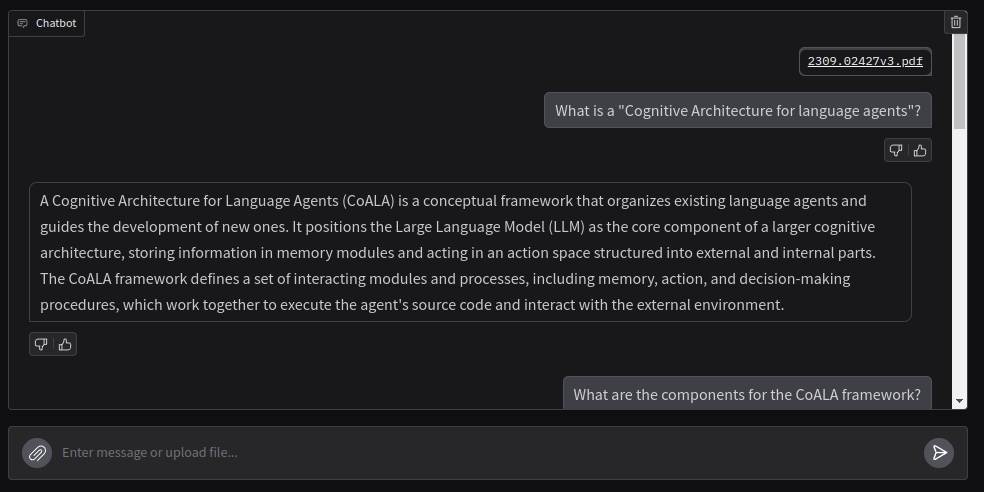

## Chat with Local Data

A simple mini-app using Llama-index, Ollama and Gradio to chat over your data

## Installation 
- Install the required libraries from the "requirements.txt" file using poetry

## Usage
- Run all the cells except the last one in "chat_with_local_data.ipynb" file
- Once you are done, run the last cell to clear memory 

