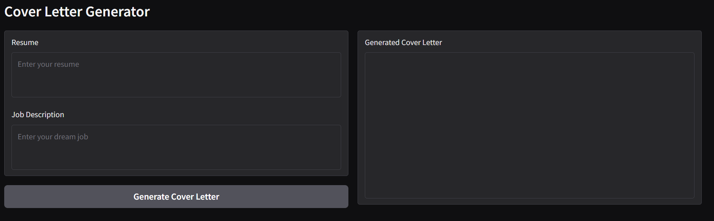

# Cover Letter Generator

## Overview

This AI-powered cover letter generator uses advanced natural language processing to craft personalized, professional cover letters based on your job application details and resume. It tailors each letter to the specific job listing, highlighting relevant skills and experiences to increase your chances of standing out to potential employers. With just a few inputs, it streamlines the application process, saving you time and effort while enhancing your job search effectiveness.

## Installation

1. Install Ollama on your computer (https://ollama.com/download)
2. Create Poetry environment
3. Install necessary libraries(ollama, gradio, ipykernel)
4. Run the jupyter notebook

## Usage

1. Run all the cells except the last one to uses
2. Run the last cell once you are done using the app in order to save system resources

## Troubleshooting

1. Ollama Installation issues
   Run the ollama installation check cell to troubleshoot your ollama installation

2. App issues
   Run the cover letter generator check cell to troubleshoot app issues
